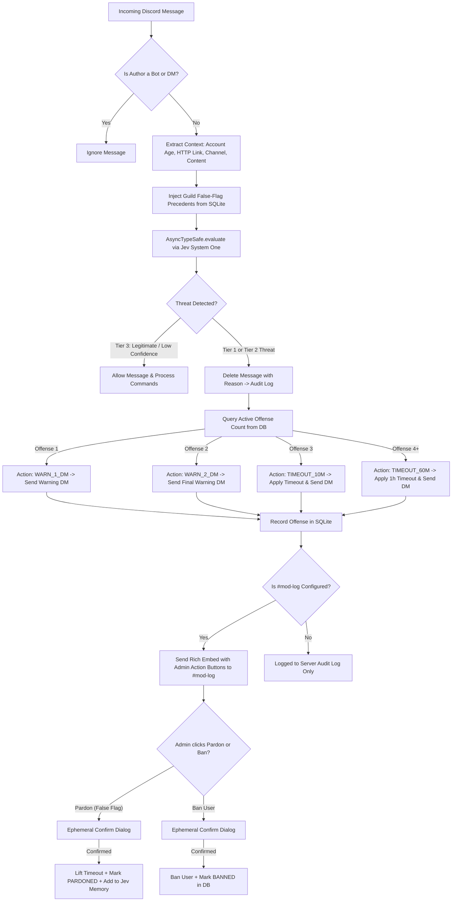

# 🛡️ Jev Moderation Bot — Real-Time Discord Moderation powered by TypeSafe AI

An asynchronous, state-of-the-art Discord moderation bot powered by the **TypeSafe AI System One decision model (`Jev`)**. 

It detects phishing links, spam, and malicious social engineering in real time, applies a **4-stage progressive escalation ladder**, logs actions to both native **Discord Server Audit Logs** and a dedicated **`#mod-log` channel**, and features **Real-Time Dynamic In-Context Learning** to continuously adapt to your community on the go.

---

## 🌟 Key Features

- **⚡ TypeSafe AI System One (`Jev`) Decision Engine**: Evaluates incoming message content and contextual metadata (author account age, link presence, channel information) in parallel using calibrated confidence distributions.
- **📈 4-Stage Progressive Escalation Ladder**:
  - **1st Offense**: Message removed immediately + User receives an automated warning DM (no timeout).
  - **2nd Offense**: Message removed immediately + User receives a final warning DM (no timeout).
  - **3rd Offense**: Message removed immediately + User is placed in a **10-minute timeout** + DM notification.
  - **4th+ Offenses**: Message removed immediately + User is placed in a **1-hour timeout** + DM notification.
  *(Timeout durations are fully configurable via `/set-timeouts`)*.
- **🧠 Real-Time Dynamic In-Context Learning ("On-The-Go" Adaptation)**:
  - Whenever an administrator pardons a false flag, that message is recorded as a verified safe precedent.
  - **On every subsequent message check in that server**, recent safe precedents are automatically injected into Jev's `state` context and `Choice` rubric criteria.
  - **Result**: Jev immediately learns your community's slang, jokes, and allowed links without requiring offline model retraining.
- **📜 Dual Logging Pipeline**:
  - **Server Audit Log**: Every deletion, timeout, and ban records detailed audit reasons (`reason=...`) directly to Discord's native Server Audit Log.
  - **`#mod-log` Channel**: Rich interactive embeds display full offense context, confidence scores, DM delivery status, and 1-click action buttons.
- **🔐 Admin-Only Interactive Buttons with Two-Step Ephemeral Confirmation**:
  - **🟢 Pardon (False Flag)**: Opens an ephemeral **Confirm Pardon** dialog. When confirmed, lifts active timeouts, marks the offense as pardoned, updates the mod-log embed, and adds the precedent to Jev's memory.
  - **🔴 Ban User**: Opens an ephemeral **Confirm Ban** dialog for 1-click escalation to a permanent server ban.
- **📋 Member Infraction Timeline (`/user-offenses`)**:
  - Review any user's past offenses with exact timestamps, what was said, channel, action taken, and resolution status (`ACTIVE`, `PARDONED`, or `BANNED`).
- **📁 Model Evaluation Dataset Export (`/export-feedback`)**:
  - Export all pardoned false flags and confirmed threats as downloadable JSON or CSV files to audit accuracy and refine TypeSafe AI prompt criteria in the TypeSafe console.

---

## 🏗️ Architecture Overview



---

## ⚙️ Slash Commands Reference

All administrative commands require the `Administrator` Discord permission:

| Command | Arguments | Permissions | Description |
| :--- | :--- | :--- | :--- |
| `/set-mod-log` | `channel:#channel` | Administrator | Designates the moderation alert channel. Validates that the bot has `View Channel`, `Send Messages`, and `Embed Links` permissions before saving. |
| `/unset-mod-log` | *None* | Administrator | Removes the mod-log channel. Moderation continues writing to native Discord Server Audit Logs. |
| `/set-timeouts` | `first_offense_mins:int`<br>`subsequent_offense_mins:int` | Administrator | Customizes the timeout duration for the 3rd offense (default: 10 mins) and 4th+ offenses (default: 60 mins). |
| `/set-thresholds` | `tier1:float`<br>`tier2:float` | Administrator | Adjusts TypeSafe AI confidence thresholds (default: `tier1=0.95`, `tier2=0.70`). |
| `/user-offenses` | `user:@member` | Moderate Members | Displays a chronological embed of the user's infractions, timestamps, what was said, and resolution status. |
| `/pardon` | `user:@member` | Administrator | Manually lifts any active timeout, marks the user's latest infraction as `PARDONED`, and records the safe precedent for Jev AI. |
| `/export-feedback` | `file_format:[json\|csv]` | Administrator | Generates and uploads a downloadable JSON or CSV dataset containing all false flags and confirmed threats for AI evaluation. |
| `/mod-config` | *None* | Administrator | Displays the current server configuration, threshold settings, timeout lengths, and active false-flag memory count. |

---

## 🚀 Installation & Setup

### 1. Prerequisites
- **Python 3.10+** (Tested on Python 3.11, 3.12, 3.13, 3.14)
- A **Discord Bot Token** from the [Discord Developer Portal](https://discord.com/developers/applications)
- A **TypeSafe AI API Key** from the [TypeSafe Console](https://console.typesafe.ai)

### 2. Clone the Repository & Install Dependencies
```bash
git clone https://github.com/your-org/jev-moderation-bot.git
cd "jev-moderation-bot"

# Optional: create a virtual environment
python3 -m venv venv
source venv/bin/activate

# Install required dependencies
pip install -r requirements.txt
```

### 3. Configure Environment Variables
Copy the `.env.example` template:
```bash
cp .env.example .env
```

Edit `.env` with your credentials:
```ini
# Discord Bot Token
DISCORD_TOKEN=your_discord_bot_token_here

# TypeSafe AI API Key
TYPESAFE_API_KEY=your_typesafe_api_key_here

# Optional SQLite Database Path (defaults to bot_data.db)
DATABASE_PATH=bot_data.db

# Optional Command Prefix
COMMAND_PREFIX=!
```

### 4. Discord Bot Privileged Intents
In the [Discord Developer Portal](https://discord.com/developers/applications):
1. Navigate to your Application -> **Bot**.
2. Under **Privileged Gateway Intents**, enable:
   - **Message Content Intent** (Required to inspect message content).
   - **Server Members Intent** (Required to apply timeouts and check member roles).
3. Under **OAuth2 -> URL Generator**, select the `bot` and `applications.commands` scopes with permissions:
   - Manage Messages
   - Moderate Members (Timeout)
   - Ban Members
   - View Channels
   - Send Messages
   - Embed Links
   - Read Message History

### 5. Run the Bot
```bash
python3 main.py
```
On startup, the bot initializes the SQLite database schema and automatically registers all slash commands with Discord.

---

## 🧪 Running Automated Tests

A comprehensive unit test suite covering database persistence, typesafe adapter mapping, moderation escalation tiers, and slash command interactions is included:

```bash
pytest -v tests/
```

Test coverage includes:
- `tests/test_database.py`: Schema migration, setting updates, offense increments, pardoning, and feedback capture.
- `tests/test_typesafe_adapter.py`: `Choice` and `Noul` schema encoding, confidence calculations, and HTTP fallback.
- `tests/test_moderator.py`: 4-stage escalation ladder (Warn 1 DM, Warn 2 DM, 10m Timeout, 60m Timeout), DM delivery handling, Admin-only button security, and ephemeral confirm/cancel dialogs.
- `tests/test_commands.py`: Permission checks in `/set-mod-log`, duration validation in `/set-timeouts`, threshold formatting, `/user-offenses` rendering, and `/export-feedback` generation.

---

## 🧠 How Real-Time In-Context Learning Works

Unlike standard rigid regex filters or static keyword blacklists, the TypeSafe AI System One decision model (`Jev`) evaluates language semantics, syntax, and probability shapes.

When an unexpected false flag occurs (for example, a user sharing a niche gaming forum link or harmless meme that triggers high scam confidence):
1. An administrator clicks **"🟢 Pardon (False Flag)"** on the `#mod-log` alert.
2. An ephemeral dialog confirms the pardon.
3. The bot immediately registers the message content in SQLite as `FALSE_FLAG`.
4. **On the very next message evaluation in that server**, the bot queries recent false flags and injects them into:
   - The `LEGITIMATE` criteria rubric under `known_safe_precedents`.
   - The structured evaluation `state` context under `COMMUNITY VERIFIED PRECEDENTS`.
5. Jev reads these server-specific safe precedents and calibrates its probability output on the fly—**permanently preventing identical or similar messages from being falsely flagged again.**

---

## 📄 License
MIT License. Feel free to use, modify, and deploy for your Discord communities.
